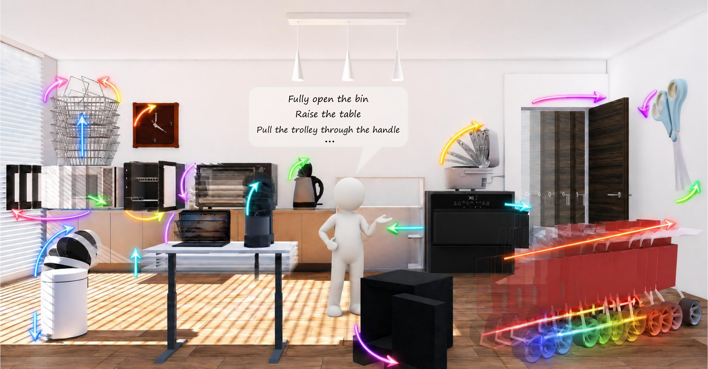

<h1 align="center">ArtiMo: Agent-Driven Articulated Mesh Animation</h1>

<p align="center">
  
  <a href="https://zou-2004.github.io/ArtiMo/"></a>
  <a href="https://huggingface.co/datasets/zcy666/ArtiMo"></a>
</p>

<p align="center">
  
</p>

ArtiMo is an agentic pipeline for action-conditioned articulated-object
animation. Given an articulated asset and a user action, it generates causal
grounding, compiles an executable animation plan, refines the plan through visual
diagnosis, and exports trajectories, animated GLBs, and optional Isaac Sim
execution bundles.

Run commands from the repository root so internal `tools/...` paths resolve
locally.

## Getting Started

Useful links:

<!-- - Project page: https://zou-2004.github.io/ArtiMo/ -->
- Benchmark and dataset: https://huggingface.co/datasets/zcy666/ArtiMo
- Documentation: [docs/Documentation.md](docs/Documentation.md)
- Benchmark and evaluation: [docs/BENCHMARK_AND_EVAL.md](docs/BENCHMARK_AND_EVAL.md)


Install:

```bash
conda create -n artimo python=3.10 -y
conda activate artimo
pip install -r requirements.txt
```

Configure model and renderer credentials:

```bash
cp configs/env.example .env
# edit .env, then:
set -a
source .env
set +a
```

At minimum, set one model key such as `OPENAI_API_KEY` or `GEMINI_API_KEY`.
For high-quality rendering, set `BLENDER_BIN=/path/to/blender`.
For faster visual rasterization and 3D evaluation, install PyTorch3D and enable
the Torch/PyTorch3D raster settings. For installation details, see
[Documentation](docs/Documentation.md#environment).

## Quickstart: Safe

This repository includes a small ready-to-run asset:

```text
examples/safe1/
  mobility.urdf
  textured_objs/
  images/
  animated_textured_safe1.glb
```

Run ArtiMo:

```bash
scripts/run_agent.sh \
  --asset_root examples/safe1 \
  --action_text "Unlock and fully open the safe. To unlock the combination lock, turn the combination dial clockwise by 90 degrees. To open the door, turn the door handle clockwise by 90 degrees first." \
  --out_root outputs/safe1_unlock_and_open \
  --vlm_model gemini-3.1-pro\
  --llm_model gpt-5.4 \
  --api_provider openai \
  --use_glb_scene auto \
  --enable_loop \
  --enable_coverage_loop \
  --enable_motion_loop \
  --coverage_max_iters 1 \
  --motion_max_iters 3
```

Main outputs:

```text
outputs/safe1_unlock_and_open/safe1/
  causal.json
  plan.json
  trajectory.jsonl
  trajectory.npz
  plan_animated.glb
```

If you only want to execute an existing plan and export a GLB:

```bash
python tools/run_plan.py \
  --asset_root examples/safe1 \
  --plan_json /path/to/plan.json \
  --out outputs/plan_replay/safe1 \
  --trajectory_jsonl outputs/plan_replay/safe1/trajectory.jsonl \
  --export_animated_glb \
  --use_glb_scene auto
```

## Common Workflows

| Task | Entry point | Details |
| --- | --- | --- |
| Prepare a raw URDF + mesh asset, including [Articraft](https://github.com/mattzh72/articraft) outputs | [scripts/textured.sh](scripts/textured.sh) | [docs/Documentation.md](docs/Documentation.md#input-assets) |
| Run ArtiMo on one action | [scripts/run_agent.sh](scripts/run_agent.sh) | [docs/Documentation.md](docs/Documentation.md#run-artimo) |
| Use mask-conditioned input | [tools/run_agent_single.py](tools/run_agent_single.py) | [docs/Documentation.md](docs/Documentation.md#mask-conditioned-input) |
| Execute an existing plan | [tools/run_plan.py](tools/run_plan.py) | [docs/Documentation.md](docs/Documentation.md#execute-an-existing-plan) |
| Export Isaac Sim bundle/video | [scripts/compile_isaacsim_bundle.sh](scripts/compile_isaacsim_bundle.sh) | [docs/Documentation.md](docs/Documentation.md#isaac-sim-export) |
| Evaluate predictions | [scripts/run_3d_eval.sh](scripts/run_3d_eval.sh), [scripts/run_2d_eval.sh](scripts/run_2d_eval.sh) | [docs/BENCHMARK_AND_EVAL.md](docs/BENCHMARK_AND_EVAL.md) |

## Application: URDF + plan to a physical robot rollout

### 1. Install

Use Python 3.10 and make sure `ffmpeg` and `ffprobe` are on `PATH`.

```bash
python3.10 -m venv venv
source venv/bin/activate
pip install -r applications/artimo_robot_contact/requirements.txt
ffmpeg -version
ffprobe -version
```

### 2. Run the complete workflow

From the repository root, run this command. Replace only the two input paths:

```bash
python applications/artimo_robot_contact/run_artimo_robot_pipeline.py \
  --urdf path/to/object/mobility.urdf \
  --plan path/to/animation/plan.json \
  --agent-command 'codex exec --sandbox workspace-write --ask-for-approval never -'
```

This is the full pipeline: it freezes the inputs, gives the English application
prompt to the agent, performs visual contact selection, collision-aware IK and
placement, one causal PyBullet rollout with its hidden negative control, video
review, and delivery verification. The final directory is printed when
the command finishes and contains exactly:

```text
outputs/robot_contact/<task-id>/
  video.mp4
  grasp.json
  result.json
```

The object URDF and every mesh/material/texture it references must be inside
this repository checkout. The Panda URDF and meshes are already included. The
agent reads the English instructions in
`applications/artimo_robot_contact/docs/`; the repository-level `docs/` belongs
to the main ArtiMo method and is not used as this application's workflow.

To use a different CLI agent, replace only the value of `--agent-command` with
a command that reads the prompt from standard input.

### Optional inputs and preparation

`trajectory.jsonl` is optional. It is never replayed as animation; when supplied,
only its first `joint_angles` row initializes non-zero object joints. To use it,
add this argument to the complete command above:

```bash
--trajectory path/to/animation/trajectory.jsonl
```

Without it, the rollout starts from the URDF default zero joint state.

Use `--prepare-only` instead of `--agent-command` only when you want to generate
and inspect the frozen English `prompt.md` and `input-lock.json` without running
the agent, physics, or video export.

## Repository Layout

```text
ArtiMo/
  applications/artimo_robot_contact/  Isolated VLA/robot-contact application.
    docs/       Agent workflow, acceptance contract, and repair playbooks.
    assets/     Bundled Panda URDF and meshes required by the default runner.
  tools/        Core agent/runtime implementation.
  evaluation/   2D/3D evaluation entry points and helpers.
  benchmark/    Benchmark annotation compilation and phase-static export tools.
  scripts/      Stable shell entry points.
  configs/      Environment template.
  docs/         Usage, benchmark, and validation notes.
  examples/     Small example assets.
```

<!-- ## Notes

- Do not commit `.env` or API keys.
- PyTorch3D and Isaac Sim are optional; install them only for GPU point-cloud
  evaluation or Isaac Sim execution.
- Benchmark data is distributed separately on HuggingFace. -->
